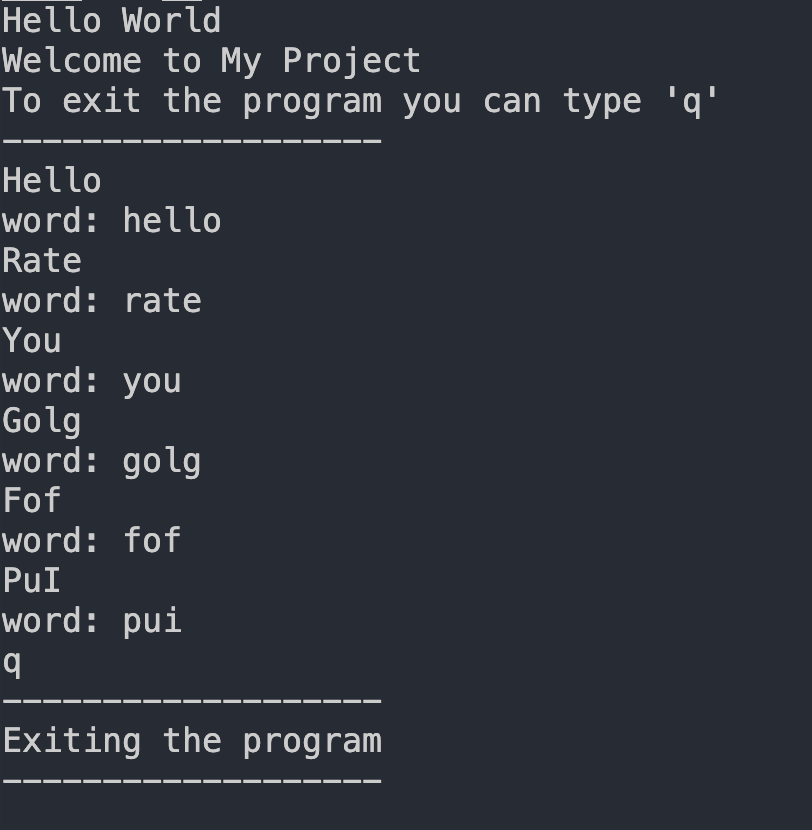
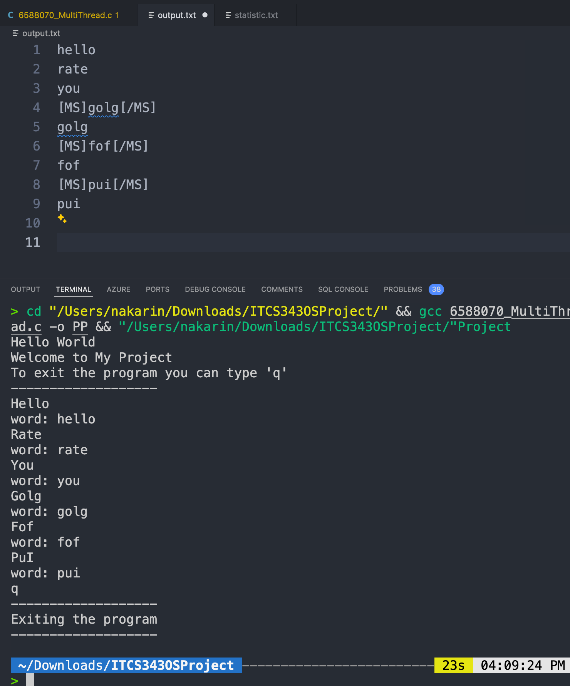
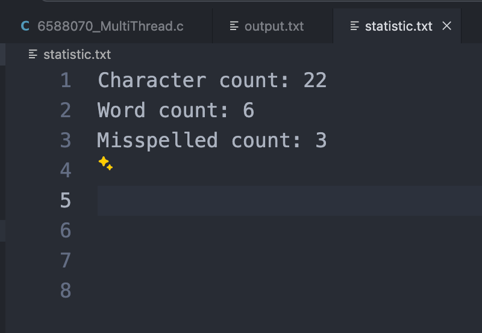

<h1>Hello</h1>
<h2> Nakarin Phoorahong 6588070 </h2>

### This is readme for project Multi Thread from ITCS343 Operating System.

#### I have not come up with an idea of rate limit yet so this is version 1.0 if I have not revise it. It would mean that I have spend time to prepare for exams.

Tasks
- [x] Read text one word at a time
- [x] Read the data sets word that being given
- [x] Spelled check function based on the data sets that being given
- [x] Count characters, words, and misspelled words
- [x] Save output as 2 files 1. output.txt 2. statistics.txt
- [x] Implement mutex and thread
- [ ] rate limit


How to the program
1. First, You have to compile the program and then run to run the already compile program.
```
gcc {filename}.c -o {file name of already compile file} && ./{file name of already compile file}
```
2. Now, It will take inpute until you input only 'q' which is mean to stop the program.

-------------------------------------
<h3>
This is example of word that I have used </h3> 



<h3>
This is for output file that have to be appended everytime that program finished
</h3>



<h3> This is statistics.txt for look into statistics of words that being input </h3>

